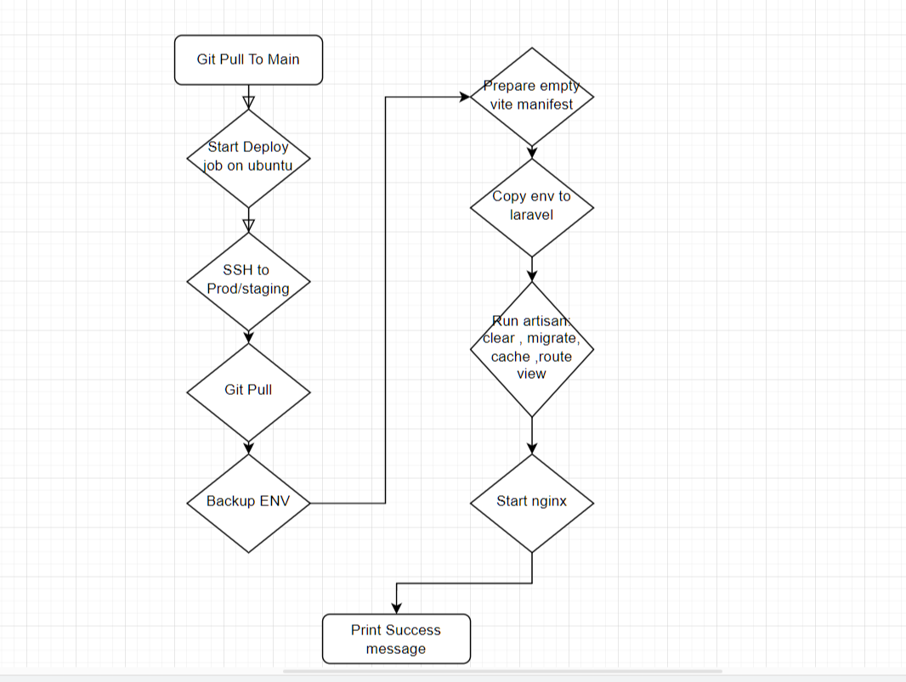

  

<!-- project overview -->

Nu Scaler is a modern desktop application designed to upscale and enhance images and video frames. It aims to provide high-quality results using smart, performance-optimized algorithms that work locally on your machine.

Built with a clean and intuitive interface, Nu Scaler helps users improve visual quality without needing expensive hardware or a constant internet connection. It's especially useful for gamers, streamers, and content creators dealing with low resolution, poor frame rate, or slow internet speeds.

  

<!-- System Design -->

### Architecture Overview

Nu Scaler follows a hybrid architecture combining Python and Rust to balance performance and flexibility. The user interface is built using PySide6 (Qt for Python), offering a modern and responsive cross-platform GUI. Behind the scenes, the heavy lifting is done in Rust, where advanced upscaling and frame interpolation algorithms are executed using WGPU-powered shaders for GPU acceleration. This separation allows the GUI to remain responsive while the computationally intensive tasks are offloaded to efficient, low-level Rust modules, ensuring both speed and stability across different systems.

| Component Diagrame                      | Flow Diagrame                         |
| --------------------------------------- | ------------------------------------- |
|  |    |

  

<!-- Project Highlights -->

### NU's Features

| Frames and resoulation Enhancements     | Cross platform support                 |
| --------------------------------------- | ------------------------------------- |
|  |    |

-Frame Interpolation: Nu Scaler includes support for frame interpolation, enhancing video smoothness—perfect for gaming, streaming, or any motion-intensive content.

-Upscaling: Leveraging GPU-accelerated upscaling via Rust and WGPU shaders, Nu Scaler delivers fast, high-quality results. It works entirely offline, preserving user privacy while processing both images and video frames.

-Cross-Compatibility: Featuring a sleek, responsive UI built with PySide6, Nu Scaler runs seamlessly across platforms. With batch processing, drag-and-drop support, and a modular architecture, it’s optimized for both casual users and advanced workflows.

  

<!-- Demo -->

### GUI

| Live Feed Main Screen                   | Live Feed ON  screen                  |
| --------------------------------------- | ------------------------------------- |
|  |    |

|  Overlay                                | settings screen                       |
| --------------------------------------- | ------------------------------------- |
|    |   |

  
### Web page

| Admin Main screen                           | admin kpis screen                       | manage users screen                   |
| ---------------------------------------     | -------------------------------------   | ------------------------------------- |
|     |         |      |

  

<!-- Testing -->

### Add Title Here

|  Debug Screen                           | Sample Peformance                     |
| --------------------------------------- | ------------------------------------- |
|      |   |

  

<!-- Deployment -->

| Deployment Worflow                      | Lint workflow                         |
| --------------------------------------- | ------------------------------------- |
|      |      |
### Public website

- http://15.237.190.24/

| Home Screen                             | Download Screen                       | 
| --------------------------------------- | ------------------------------------- | 
|       |  | 

  
