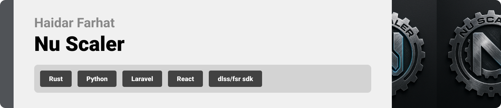
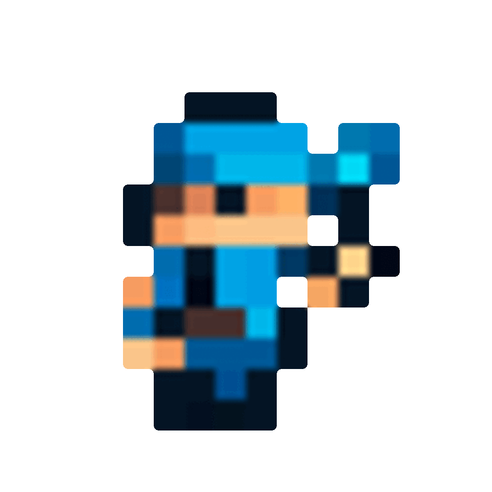

# Nu Scaler

  

<!-- project overview -->

Nu Scaler is a modern desktop application designed to upscale and enhance images and video frames. It aims to provide high-quality results using smart, performance-optimized algorithms that work locally on your machine.

Built with a clean and intuitive interface, Nu Scaler helps users improve visual quality without needing expensive hardware or a constant internet connection. It's especially useful for gamers, streamers, and content creators dealing with low resolution, poor frame rate, or slow internet speeds.

  

<!-- System Design -->

### Architecture Overview

Nu Scaler follows a hybrid architecture combining Python and Rust to balance performance and flexibility. The user interface is built using PySide6 (Qt for Python), offering a modern and responsive cross-platform GUI. Behind the scenes, the heavy lifting is done in Rust, where advanced upscaling and frame interpolation algorithms are executed using WGPU-powered shaders for GPU acceleration. This separation allows the GUI to remain responsive while the computationally intensive tasks are offloaded to efficient, low-level Rust modules, ensuring both speed and stability across different systems.
 
| Component Diagram                       |
| --------------------------------------- |
|  |

| Flow Diagram                          |
| ------------------------------------- |
|    |
  

<!-- Project Highlights -->

### NU's Features

| NU's highlight     |
| --------------------------------------- |
|  | 

- **Frame Interpolation**: Smooths motion in videos, ideal for gaming and streaming.
- **Upscaling**: Fast, high-quality offline upscaling using Rust and WGPU shaders.
- **Cross-Compatibility**: Runs on all platforms with a sleek UI and advanced features.

  

<!-- Demo -->

### Showcase
| Real-Time Test                     |
| ------------------------------------- |
|    |

| Sample Test                             |Performance Testing                        |
| --------------------------------------- | ------------------------------------- |
|  |    |

### GUI

| Live Feed Main Screen                   | Live Feed (Active)                  |
| --------------------------------------- | ------------------------------------- |
|  |    |

|  Overlay                                | settings screen                       |
| --------------------------------------- | ------------------------------------- |
|    |   |

  
### Web page

| Admin Main screen                           | manage users screen                   |
| ---------------------------------------     | ------------------------------------- |
|     |      |

  

<!-- Testing -->

### Debug and testing

|  Debug Screen                           | Sample Performance                     |
| --------------------------------------- | ------------------------------------- |
|      |   |

| Low-Res 2D                              | Enhanced 2D|
| --------------------------------------- | ------------------------------------- |
|    |    |

  

<!-- Deployment -->

| Deployment Worflow                      | Lint workflow                         |
| --------------------------------------- | ------------------------------------- |
|      |      |

### Live Demo

You can try Nu Scaler from the official site:

🌐 **[Live Site](http://15.237.190.24/)** – Desktop app preview and download links.

| Home Screen                             | Download Screen                       | 
| --------------------------------------- | ------------------------------------- | 
|       |   | 

  
